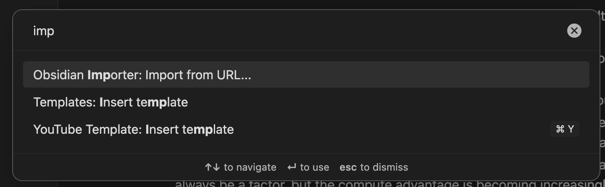
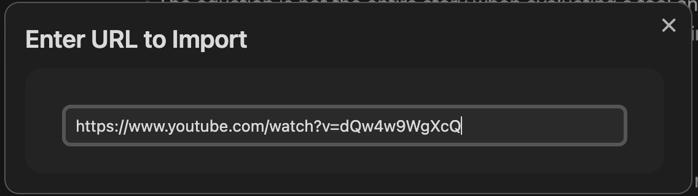
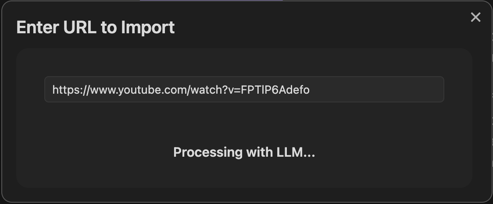

# Obsidian Importer Usage Guide

This guide provides detailed examples of how to use the Obsidian Importer plugin with different content types, along with screenshots of the process.

## Importing a YouTube Video

### Step 1: Invoke the Import Command
Open the command palette (`Ctrl/Cmd + P`) and search for "Import from URL..."



### Step 2: Enter YouTube URL
Enter a valid YouTube URL in the modal dialog that appears and press Enter.



### Step 3: Watch the Import Progress
The plugin will show progress as it:
1. Validates the URL
2. Detects the content type (YouTube)
3. Downloads the transcript and metadata
4. Processes with the configured LLM
5. Creates the note in your vault



### Step 4: View the Created Note
Once complete, a new note will be created in your configured folder (default: "Sources").


## Example Output

Below is an example of the note structure created from a YouTube video about programming best practices:

```markdown
---
title: "10 Programming Principles Every Developer Should Know"
source_url: "https://www.youtube.com/watch?v=dQw4w9WgXcQ"
author: "CodeMaster"
import_date: "2025-04-14"
type: "youtube"
---

# 10 Programming Principles Every Developer Should Know

[](https://www.youtube.com/watch?v=dQw4w9WgXcQ)

**Channel:** CodeMaster  
**Published:** February 10, 2025

## Summary
This video presents ten fundamental programming principles that improve code quality and developer productivity. The principles include SOLID, DRY, KISS, and YAGNI, with practical examples of each principle in action across different programming languages.

## Key Points
- The SOLID principles help create maintainable and scalable software architecture
- DRY (Don't Repeat Yourself) reduces code duplication and maintenance effort
- KISS (Keep It Simple, Stupid) advocates for simplicity over unnecessary complexity
- Writing tests first (TDD) helps clarify requirements and improve design
- Consistent formatting and naming conventions improve code readability
- Comments should explain "why" not "what" the code does
- Learning design patterns helps solve common programming problems
- Performance optimization should come after code clarity and correctness
- Code reviews improve quality and share knowledge across the team
- Continuous learning is essential as technology evolves rapidly

## Key Concepts
- SOLID Principles
- Test-Driven Development
- Design Patterns
- Code Quality
- Technical Debt
- Refactoring
- Code Reviews
```

## Tips for Better Results

### Choosing Good Videos
The plugin works best with videos that:
- Have clear, structured content
- Are between 5-30 minutes long
- Have good quality automatic captions
- Focus on educational or informational content

### Customizing Storage Location
You can change where imported notes are stored:
1. Open Settings → Obsidian Importer
2. Change the "Default Folder" setting
3. Create a folder structure like "Sources/YouTube" to organize by source type

### Using Debug Mode
If you encounter issues or want to understand the process better:
1. Enable Debug Mode in settings
2. Open Developer Tools (Ctrl/Cmd + Shift + I)
3. Look for logs prefixed with "[ObsidianImporter]"

## Keyboard Shortcuts

For faster workflow, consider assigning a keyboard shortcut to the "Import from URL..." command:

1. Go to Settings → Hotkeys
2. Search for "Import from URL..."
3. Click the plus icon to assign a keyboard combination
4. Recommended: `Ctrl/Cmd + Shift + I`